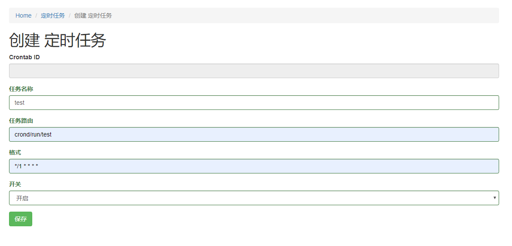

yii2-crond
==========

安装方式
------------

 [Composer](http://getcomposer.org/download/)

运行

```
composer require --prefer-dist wowthink/yii2-crond
```

或者

直接下载归档 进行配置

`common/config/mian.php`

```php
    'aliases' => [
        'wowthink/crond' => '.../yii2-crond/src',
    ]
```


用法
-----

安装扩展后，只需在代码中使用它 :

配置后台显示
`backend/config/mian.php`

```php
    'modules' => [
        'crond' => [
            'class' => 'wowthink\crond\Module',
        ],
    ],

```
配置命令行
`console/config/mian-local.php`

```php
    'bootstrap' => ['crond'],
    'modules' => [
        'crond' => [
            'class' => 'wowthink\crond\Module',
            'php_path' => '/usr/bin/php', //默认php
            'yii_path' => '/home/wwwroot/base/yii', //默认yii
        ],
    ],
```
执行migrate
`php yii migrate --migrationPath=@wowthink/crond/migrations`

启动定时任务
`php yii crond/run`

默认进入后台地址：/crond/index/index


